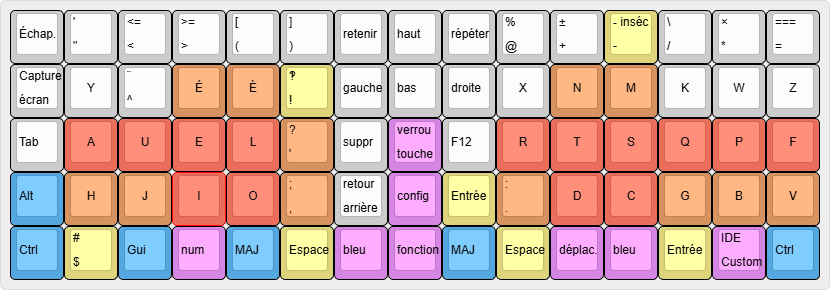
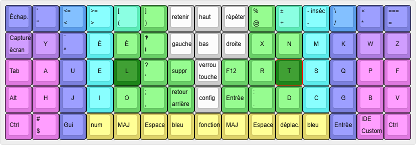
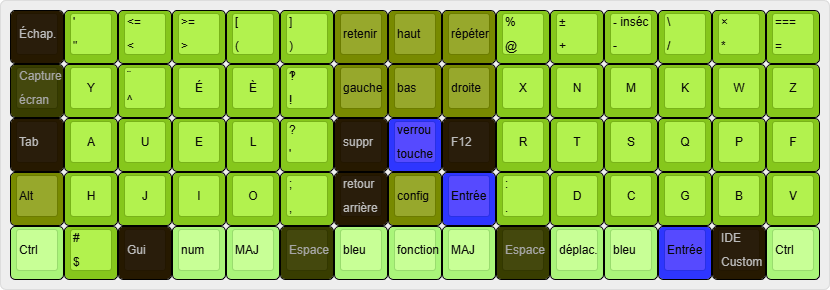
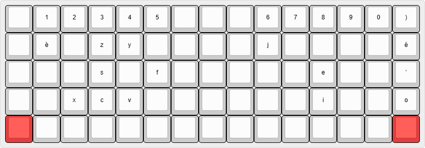
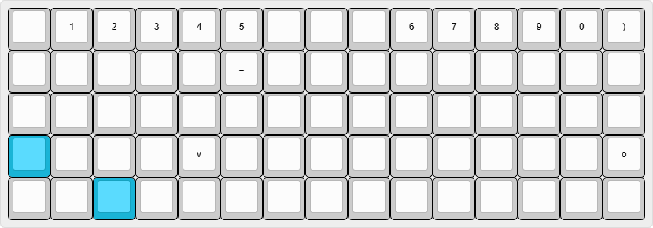
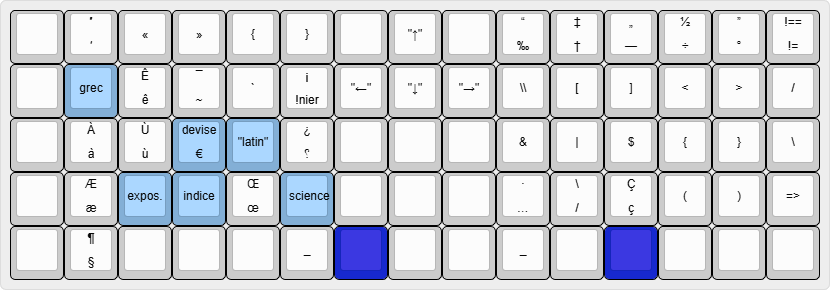
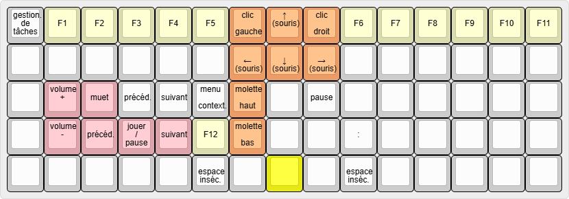
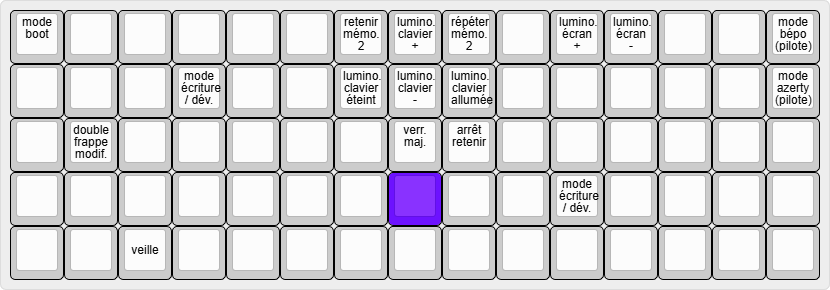

# aokb-pseudosplit-stdev
## Caractéristiques générales
Clavier cible : [YMDK id75](https://ymdkey.com/products/id75-75-keys-ortholinear-layout-qmk-anodized-aluminum-case-plate-hot-swappable-hot-swap-type-c-pcb-mechanical-keyboard-kit) ou la [version acrylique](https://ymdkey.com/products/idobao-x-ymdk-id75-acrylic-case-kit-via-hotswap-supported-rgb-wired?pr_prod_strat=e5_desc&pr_rec_id=375eb328b&pr_rec_pid=6889882222653&pr_ref_pid=4370882330685&pr_seq=uniform).

Nombre de touches : 75

Pilotes compatibles : [Bépo](https://bepo.fr/wiki/Installation), AZERTY (compatibilité partielle).

Disposition : AUEL↓ (AUEL, une disposition française avec préférence pour le 2 lignes basses. Séparation mains gauche et droite par 3 colonnes centrales.
### Description
Cette disposition est pensée pour un développeur écrivant à la fois en français et en anglais, et favorise les combinaisons plutôt que les déplacements en assumant une importante redondance.
## Couche principale

En rouge/orange/jaune, les touches fréquemment tapées.
En bleu, les touches modificatrices communes, en rose, les touches modificatrices spécifiques au clavier.

### Positionnement recommandé
La position de repos se trouve sur la ligne centrale, les index posé sur les touches L et T.

Sur l’image ci‑dessus, chaque couleur représente un doigt qu’il est recommandé d’utiliser pour la frappe des touches : l’auriculaire en rose, l’annulaire en bleu-violet, le majeur en cyan, l’index en vert et le pouce en jaune. Les couleurs intermédiaires des zones d’incertitudes entre deux doigts.
Les pouces gagnent énormément de rôles, puisqu’à l’espace s’ajoutent désormais 5 touches modificatrices.

> [!TIP]
> L’appui simultané sur les deux touches MAJ passe le clavier en mode d’écriture "`MAJUSCULES_AVEC_TIRETS_BAS_POUR_ESPACES`"

### Variance du toucher
Les touches ont des résistances à pression différentes pour aider la mémorisation tactile, et avoir un retour au toucher et auditif sur le placement.

Les touches en bleu sont sonores (elles cliquent). Pour les autres, l'intensité de la couleur représente leur résistance sous les doigts.

## Couches modificatrices
### Modificateurs standards
#### Contrôle

L’idée est de facilité l’adaptation pour les raccourci suivant : 
* couper, copier, coller,
* annuler, refaire,
* sauvegarder, charger (chercher s’en trouve décalé sur la gauche),
Ainsi que de s’assurer que les touches hautes sont utilisables avec la touche contrôle.

#### Autres modificateurs
La même logique est appliquée dans une moindre mesure aux touches `alt` et `gui`.

### Modificateurs thématiques
#### Déplacement
La touche déplacement active la couche par maintien de la touche ou par simple frappe sur la touche.
![[aokb-pseudosplit-stdev.déplacement.png]]
Cette couche utilise uniquement la main droite. 
La disposition a été choisi au départ avec VIM à l’esprit, mais avec une préférence pour ← et → sur l’index et le majeur, car ils sont le plus souvent utilisés. Ce choix a été ensuite suivi par l’idée de maintenir une homogénéité de direction associée à chaque doigt.

#### Bleu
La couche bleue, sorte de touche `altgr` révisée, présente des caractères et modificateurs d'écriture à gauche, et des caractères de développeur à droite. 
Les touches bleue pâle sont utilisées de la même façon que des accents, il faut appuyer d'abord sur cette touche puis sur celle à laquelle on souhaite appliquer ce modificateur, par exemple :
* `grec` puis `f` donne `φ`,
* `devise` puis `c` donne `¢`,
* `expos.` puis `e` donne `ᵉ`.

La documentation complète pour chaque modificateur est disponible sur [bepo.fr](https://bepo.fr/wiki/Accueil), par exemple pour le ["latin"](https://bepo.fr/wiki/Latin_et_ponctuation#Caract%C3%A8res_disponibles), le [grec](https://bepo.fr/wiki/Lettres_grecques#D%C3%A9finitions) ou [les symboles scientifiques](https://bepo.fr/wiki/Symboles_scientifiques#Liste_d%C3%A9taill%C3%A9e_des_caract%C3%A8res).

#### Numérique
![[aokb-pseudosplit-stdev.numérique.png]]
Comme la touche de déplacement, ce modificateur est activable pour pression continue ou par simple frappe.
La partie droite imite un pavé numérique étendu à l'écriture hexadécimale et des raccourcis pour l'utilisation de la calculatrice.
L'ensemble des symboles mathématiques est insérable avec la main gauche seulement. Sur la ligne basse à gauche se trouvent la majorité des séparateurs utiles. Le dièse et le point‑virgules sont rapprochés à gauche pour la saisir entête et finale d'une couleur.

### Modificateurs utilitaires
#### Fonctions
Comme la touche de déplacement, ce modificateur est activable pour pression continue ou par simple frappe.

Cette couche présente évidemment les touches fonctions (d'où la nécessité de pouvoir l'activer sans la maintenir), ainsi que des touches de contrôle de média (en rose) et déplacement de la souris. 
La présence des espaces insécables vient de la position de la touches par rapport aux espaces ; au dessus de celui de droite se trouve `:` pour le très fréquent ` :`.

#### Configuration

